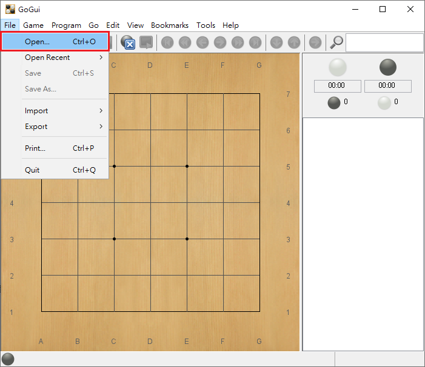
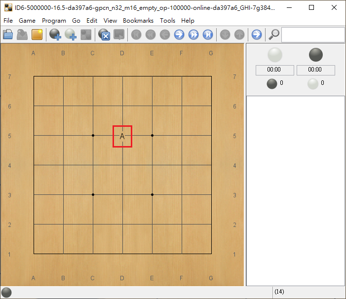
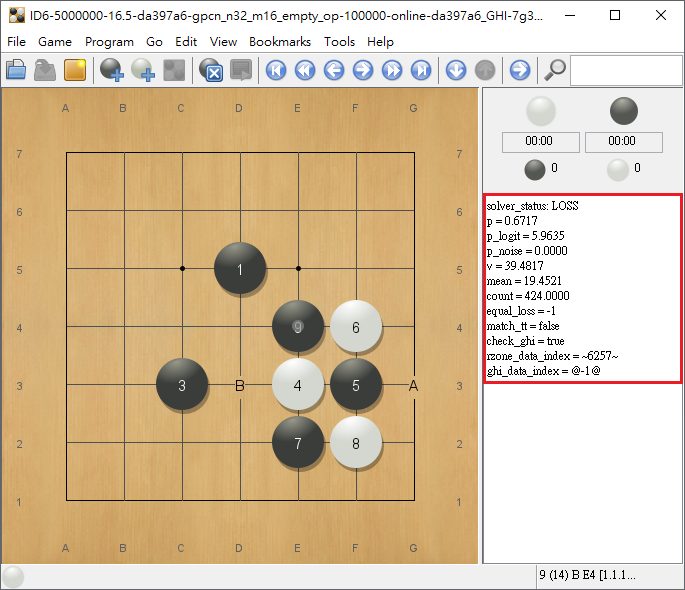
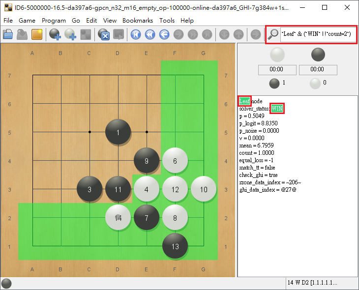
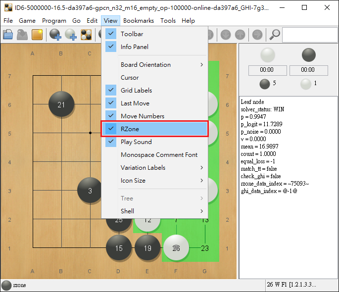
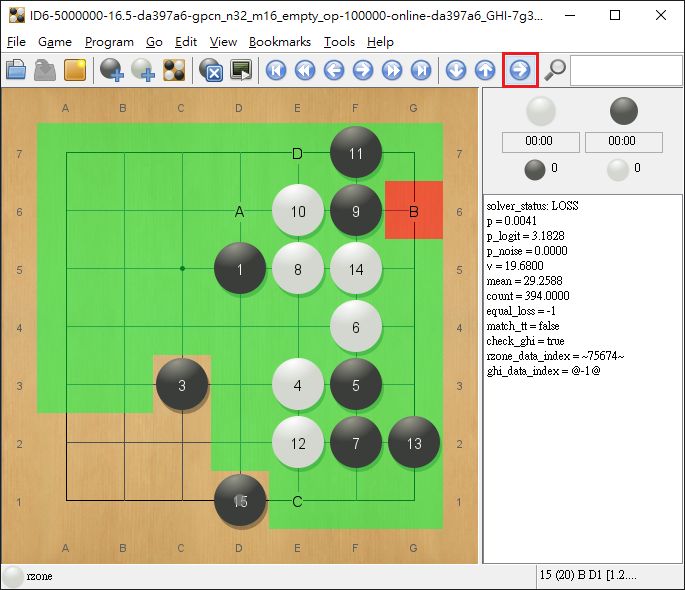

## Tools

This subsection describes the usage of miscellaneous tools related to the game solvers.
* [GoGui](#GoGui)
* [GoGui advanced](#GoGui-advanced)
* [SGF editor tool](#SGF-editor-tool)

### GoGui

We use GoGui to open the `.sgf` files. 
You can download it from the source (https://github.com/iis-rlg-lab/gogui-general/releases/), developed by the team of Remi-Coulom.

A desktop with 10G memory above is required when opening the files with GoGui since some solution trees are enormous.
 
There are some instructions below to guide you to traverse the solution tree.

**Step 1: Open the files**
Open the `.sgf` files by double-clicking them or through the file menu on the top panel.




**Step 2: Go to the root position**
When the file is loaded, you will see an empty go board. Click on the board directly following the alphabet symbols or scroll the mouse wheel to the root position with four stones. Then, you can go through any positions you want to check if there are alphabets on the board.



**Step 3: Traverse the tree**

The right window shows corresponding comments for the current position.




Here is some basic information in the comments that help you traverse the tree.
* `solver_status`: WIN, LOSS, UNKNOWN to indicate the theoretic values for the current position.
* `match_tt`: whether the position is proved by the transposition table.
For the case of `match_tt = false`:
If it is white to play, you can find at least one winning move leading to a node whose `solver_status` is `solver_status: WIN`.
If it is black to play, all moves will lead to a node whose `solver_status` is `solver_status: LOSS`.
For the case of `match_tt = true`:
You can press `Ctrl` + `F` to search "`rzone_data_index =`" with the associated index in the comment, e.g. "`rzone_data_index = ~582369~`", and find the position with the same `rzone_data_index` and `match_tt = false`, where you can continue to traverse the solution tree. 
* `p`: the policy value of the PCN network.
* `v`: the value that estimated the number of nodes to solve the position by the PCN network.
* `equal_loss`: the sibling move node the prunes current black move if not equal -1
Since we apply relevance zones in our proof, you will also find some black moves with "`equal_loss`" not -1, and you will find the corresponding sibling node for you to replay the next winning move.

### GoGui advanced

#### Search in comment

To make searching more convenient, we have expanded the functionality of regular expressions to handle more complex conditions. Here's how to use it:

```
`regexp1` & (`regexp2` | !`regexp3`)
```

In this example, the condition is only met when `regexp1` is `true` and either `regexp2` is `true` or `regexp3` is `false`. When this happens, GoGui will jump to the first node that meets this search rule and automatically mark the corresponding text. Pressing the search button or `F3` will jump to the next matching node until no nodes match.




#### Show Relative Zone (RZone)

For a more convenient view of the game results, you can toggle the display of RZone in the View menu.




#### Forward to the largest child node

Navigate to child node with most nodes.




### SGF editor tool

It allows to specify input and output file names, and apply various transformations such as horizontal or vertical flipping, clockwise rotation, and RZone format conversion. For more information please run the following command.

```bash
./scripts/sgf_editor.py --help
```
